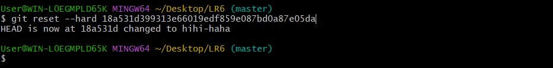

# LR6
Лабораторная работа №6
1-2. Был создан аккаунт на Git и сделана копия в личное хранилище из Kurtyanik/LR6/

3. Установлен Git.

4.  Настройка клиента Git, введено имя пользователя и email.

5. Клонирование удалённого репозитория на компьютер.

6. Добавлен файл через интерфейс GitHub и подтянуты изменения в локальном репозитории.

7-8. Просмотрены последние изменения. 

9. Создан конфликт и выполнено слияние в ветку master.
Просмотр имеющихся файлов и использование nano для редактирования текстового файла

Добавление и коммит отредактированного файла:

Те же самые действия проделаны в ветке newbranch:

Переход в ветку мастер и обнаружение конфликта при попытке слияния:
Конечное редактирование:

Окончательное добавление и коммит файла:

###После этого была использована команда git add newfile и git commit -m 'conflict solved'
10. После этого ветка newbranch была удалена с помощью команды:
git branch -d newbranch
11. Создание другого файла и нескольких коммитов

12. Откат последнего коммита:
Просмотр последних коммитов для ознакомления с hash-code для последующего hard-reset:

Результат hard-reset

13. Создание новой ветки для отчёта:

#После окончания написания отчёта произвел команды git add и git commit и отправил изменения в удалённый репозиторий с помощью git push.

